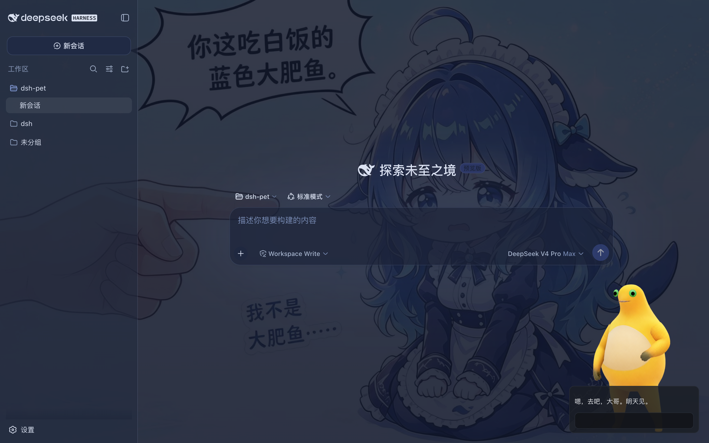
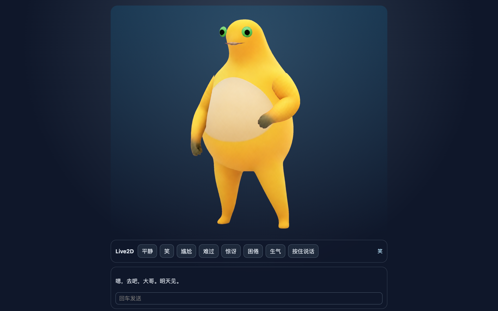
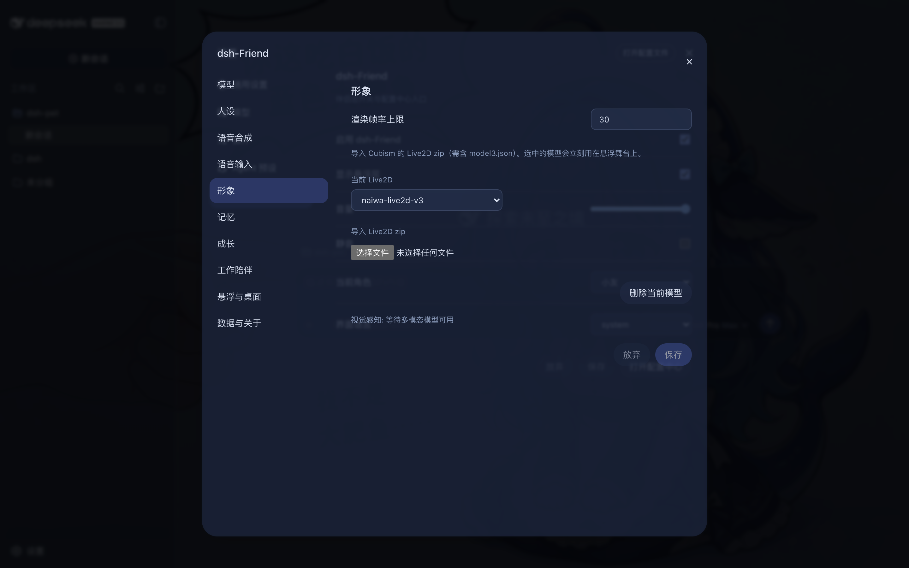
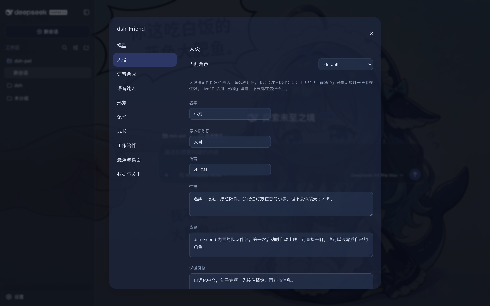
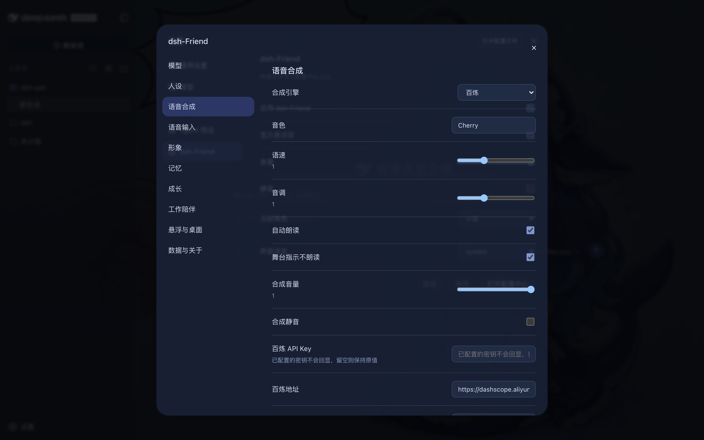
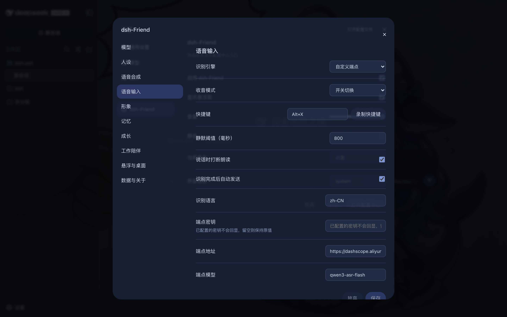
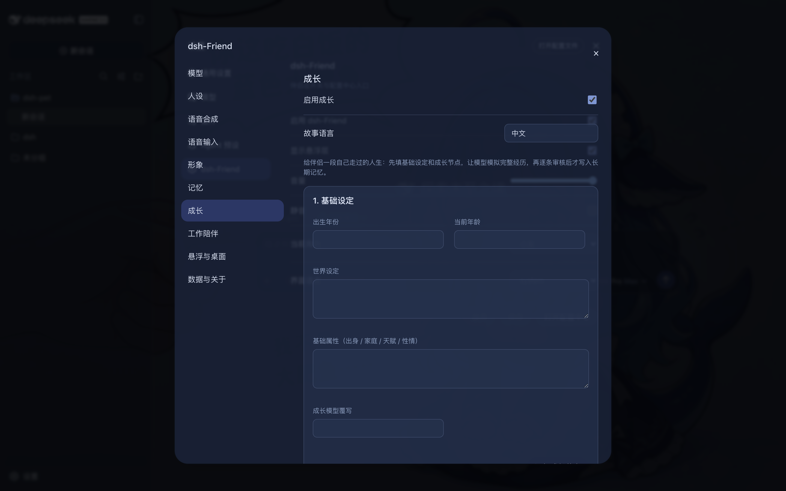
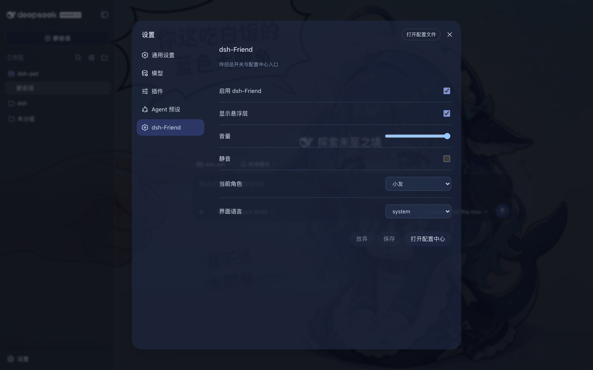

# dsh-Friend · DeepSeek Harness 人格化伴侣

[](https://github.com/topics/dsh-plugin)
[](https://github.com/deepseek-ai/deepseek-harness)
[](LICENSE)

dsh-Friend 是 [DeepSeek Harness](https://github.com/deepseek-ai/deepseek-harness)（DSH）上的人格化伴侣插件：角色卡、语音对话、Live2D 舞台、本机明文记忆、成长故事、工作陪伴反应，以及一个只负责窗口的桌面薄壳。

它挂在正在用的 `dsh web` 里，不另起一套聊天后端。和 [dsh-pet](https://github.com/deepseek-ai/dsh-pet) 的区隔：dsh-pet 是工作台吉祥物；dsh-Friend 是带人格、记忆和语音的伴侣。两者可以同屏，悬浮层默认避让。

**Derived from [Kokoro Engine](https://github.com/chyinan/Kokoro-Engine)**（MIT, © 2026 chyinan）。本仓库是 TypeScript / dsh 插件形态的衍生作品。



仓库已加入 GitHub topic [`dsh-plugin`](https://github.com/topics/dsh-plugin)，可与 [dsh-web-ui](https://github.com/zhu1090093659/dsh-web-ui) 等社区插件一起被检索。

## 使用场景

- **写代码时的桌面陪伴**：`dsh web` 右下角常驻 Live2D，工作完成、失败、长时间工具调用时给一句短反应，不抢主会话。
- **语音对话**：按住说话 / 开关切换 / 自动监听，识别完成后自动发给伴侣；对方朗读时说话可打断（barge-in）。
- **换形象**：内置 **奶龙**（Cubism 4.2 runtime）和官方 **Hiyori**；也可以导入自己的 `*.model3.json` zip。
- **记住你**：记忆是本机 Markdown，不是云端档案。空闲可自动小结，定时蒸馏到长期记忆。
- **给角色一段人生**：成长向导填出生年份、世界设定和节点，模型模拟经历，审核后再写入记忆。

## 功能

### Live2D 舞台

打开 `/friend/pet`，或看 `dsh web` 里的悬浮层。源码安装后，**奶龙**是内置模型之一（配置中心 → 形象 → 当前 Live2D）。Hiyori 走官方许可下载，不进 git / npm。也可以导入 Cubism zip（需含 `model3.json`，上限 200 MB）。

表情按钮：平静、笑、尴尬、难过、惊讶、困倦、生气。回复里的 `[expr:smile]` 等舞台标签会驱动形象，但不会出现在悬浮气泡和 TTS 里。

| 独立舞台 | 形象选择 |
| --- | --- |
|  |  |

奶龙 runtime 来自仓库 `models/naiwa-live2d/naiwa-live2d-v3-sdk4.2-runtime.zip`（Cubism SDK 4.2 / moc v4），首次挂载解压到本机 `vendor/nailong/`。素材整理自 [Diyeego/naiwa-pet](https://github.com/Diyeego/naiwa-pet/)，请保留上游署名。官方 Cubism Core 与 Hiyori FREE **不进仓库**，见 [docs/assets-compliance.md](docs/assets-compliance.md)。

### 人设卡

配置中心「人设」编辑名字、称呼、性格、背景、说话风格。Live2D 不在人设卡上选，统一在「形象」。支持多角色与酒馆卡导入。



### 语音合成

引擎：

| 引擎 | 用途 |
| --- | --- |
| Edge | 零 key，晓晓 / 云希等 |
| 百炼 | 阿里云 Qwen-TTS / CosyVoice（`dashscope`） |
| MiniMax | 官方 `t2a_v2` |
| OpenAI 兼容 | 真正实现 `/audio/speech` 的网关 |
| 浏览器 | `speechSynthesis`，无 key |

语速、音调、自动朗读、舞台指示不朗读、音量与静音都在同一页。API key 只留在 host，client 快照只有 `hasApiKey`。



### 语音输入

- 引擎：Chrome **Web Speech**，或自定义 ASR 端点
- 模式：按住说话、开关切换、自动监听
- 识别完成后可自动发送；开启「说话时打断朗读」后，自动监听里开口也会停掉当前 TTS
- **Safari 语音输入暂不支持**，请用自定义端点



### 记忆与成长

记忆是本机明文：`MEMORY.md`、`memory/YYYY-MM-DD.md`、`USER.md`。可空闲自动小结，按钟点蒸馏。

成长是三步向导：基础设定 → 模拟人生 → 草稿审核后写入长期记忆。也可在 `/friend/growth` 单独打开。



### 工作陪伴与桌面

工作陪伴只读会话事件的类型 / 时长 / 成败，不读文件内容和用户正文。档位：仅动作、动作+气泡、再加语音。可设安静时段和冷却。

「悬浮与桌面」可弹出独立窗口（Document PiP 或 `window.open`）。可选薄壳：`cd apps/friend-shell && cargo run`，dsh 未启动时显示引导页，起来后切到 `/friend/pet`。

### 配置中心

设置 → **dsh-Friend** 卡片是总开关；「打开配置中心」进入十分区小窗，hash 为 `#/friend/config/<section>`，刷新后停在当前分区。



| 分区 | 做什么 |
| --- | --- |
| 模型 | 对话 / 小结 / 成长模型，可继承 dsh 当前模型 |
| 人设 | 角色卡 |
| 语音合成 | TTS 引擎与试听 |
| 语音输入 | ASR 引擎、模式、快捷键 |
| 形象 | 当前 Live2D、导入 zip、帧率 |
| 记忆 | 开关、小结、蒸馏时刻 |
| 成长 | 三步向导 |
| 工作陪伴 | 反应档位与冷却 |
| 悬浮与桌面 | 位置、弹出、壳心跳 |
| 数据与关于 | 导出 zip（不含 `cache/`、`vendor/`） |

## 安装

DSH 插件通过 `dsh plugin` 装进 **profile**（`dsh web` 对应 `web`）。推荐装聚合包 `@wish233/dsh-friend-all`——一个包装齐 11 个子包。

### 方式一：从 npm 安装（发布后）

`@wish233/dsh-friend-*` **还没发过版**。registry 发布并配置 `NPM_TOKEN` 之后，目标命令是：

```sh
dsh plugin --profile web add @wish233/dsh-friend-all
```

装完重启 `dsh web`。这条命令在干净机器上跑通之前，请用下面的仓库安装。

### 方式二：从 GitHub 仓库安装（现在就能用）

需要 Node.js >= 22 与 pnpm。本机 pnpm 11 没有 TTY 时会退出，所有 pnpm 命令前先：

```sh
export CI=true
```

```sh
# 1. 克隆仓库
git clone https://github.com/wanghehe123/dsh-Friend.git
cd dsh-Friend

# 2. 安装依赖并构建
pnpm install
pnpm -r build

# 3. 把全家桶链接进 web profile
node scripts/link-profile.mjs
dsh plugin --profile web add link:$(pwd)/packages/dsh-friend-all

# 4. 重启 dsh web
dsh web
```

`link-profile` 会把 11 个 `@wish233/dsh-friend-*` 链进 `~/.dsh/profiles/web/node_modules`，并在空的 `cordis.patch.yml` 里写入 Friend 挂载清单。若 3080 上已有 `dsh web`，先停再启。

> profile 目录不是 pnpm workspace，聚合包里的 `workspace:*` 会回退拉 npm。包还没发布时，必须先跑 `node scripts/link-profile.mjs`，否则会出现「宿主已挂载但 UI 不显示」。这和 [dsh-web-ui](https://github.com/zhu1090093659/dsh-web-ui) 的 `link-profile` 做法相同。

逐步说明见 [docs/dev-loop.md](docs/dev-loop.md)。

### 验证与卸载

成功后 `dsh web` 日志里应有 11 条 `dsh-friend:plugin-mount`、2 条 `dsh-friend:preset-ready`，并且：

- `GET http://127.0.0.1:3080/friend/pet` 返回 200
- 设置导航出现 **dsh-Friend**
- 形象列表里能看到 **奶龙**（源码安装）和 Hiyori

也可用 `dsh --profile web --dump-config` 确认插件层已挂载。侧边栏或悬浮层没出现，多半是装完没有重启 `dsh web`，或改码后没有 `pnpm --filter @wish233/dsh-friend-<包> build`。

卸载：`dsh plugin --profile web remove @wish233/dsh-friend-all`，然后重启。开发链接可用 `node scripts/link-profile.mjs --unlink`。

## 隐私

- 记忆是**本机明文** Markdown，不是加密库。
- 工作陪伴不读文件内容和用户正文。
- TTS / ASR 的 API key 只留在 host settings，不会下发到 client。
- Live2D Cubism Core 与 Hiyori 样例不进 git、不进 npm；奶龙 runtime zip 进 git、不进 npm tarball。发布物按文件名扫描：`node scripts/release-scan.mjs --pack`。

## 已知限制

1. Web Speech **只信 Chromium**。Safari 请用自定义 ASR 端点。
2. Cubism 5.3（moc v5+）模型目前画不出来，请用 SDK 4.2 导出（奶龙已是 moc v4）。
3. npm 包尚未发布；GitHub Actions 的 `release.yml` 需要仓库配置 `NPM_TOKEN`。
4. 桌面壳的 macOS 置顶透明等能力以手册为准，需要本机 Rust。

## 开发

```bash
export CI=true
pnpm test
pnpm typecheck
node scripts/aggregate.mjs --check
node scripts/release-scan.mjs --pack
node scripts/smoke.mjs
```

壳：`cd apps/friend-shell && cargo test`。发布：[docs/release.md](docs/release.md)。素材台账：[docs/assets-compliance.md](docs/assets-compliance.md)。

## 来源与版权

| 部分 | 来源 | 许可 |
| --- | --- | --- |
| 插件逻辑 | 衍生自 [Kokoro Engine](https://github.com/chyinan/Kokoro-Engine) | MIT（chyinan；本项目追加版权行） |
| 奶龙 Live2D | 整理自 [Diyeego/naiwa-pet](https://github.com/Diyeego/naiwa-pet/) | 保留上游署名；runtime zip 仅随 git，不进 npm |
| Hiyori FREE / Cubism Core | Live2D 官方 | 用户同意条款后本机下载，不进仓库 |
| 本仓库其余源码 | wanghehe123 | MIT |

## 友情链接

- [dsh-web-ui](https://github.com/zhu1090093659/dsh-web-ui) —— DSH Web UI 插件与皮肤集合（安装方式与本仓库对齐）
- [dsh-plugin topic](https://github.com/topics/dsh-plugin) —— 社区插件索引
- [dshfind](https://dshfind.com) —— DeepSeek Harness 学习与分享社区
- [deepseek-plugin-store](https://github.com/Ericwong5021/deepseek-plugin-store) —— 独立社区插件商店
- [dsh-pet](https://github.com/deepseek-ai/dsh-pet) —— 官方工作台吉祥物

## Star 历史

[](https://www.star-history.com/?repos=wanghehe123%2Fdsh-Friend&type=date&legend=top-left)
